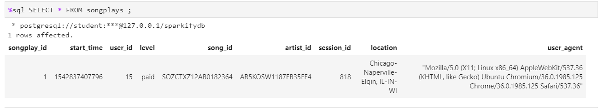

# ETL SPARKIFY  
The purpose of this project is to make song data and Sparkify's new app user activity data accessible to the team through a Posgres database.    

## Motivation  
Information on songs metadata was stored in individual json files while user activities were being stored in json files within log files without a structured way of accessing the information for informative decisions. This project consolidated the data in a star schema within a postgres database to make it easier for stake holders to access. The schema within the database is set up in a star schema to reduce duplicates and make it easier to separate fact and dimensions.  

## How to run the code  
1. First use terminal to run the create_tables.py file.
2. After the tables have been created, then run etl.py file to load the data into Postgres.
3. Using test.ipynb notebook, you can view the results and test whether it worked.

## Schema  
    

## Build Status  

 The project has been completed and ready for deployment.  

 ## Code Style  

 Standard.  

 ## Screenshots  
   
